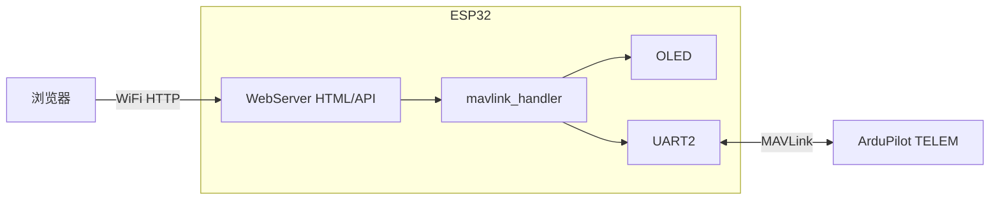

# WEB-MAVLINK

基于 **ESP32** 的简易 **MAVLink 地面站**：通过 **Wi-Fi 热点** 提供网页控制台，经串口与 **ArduPilot 固定翼（Plane）** 飞控通信；可选 **SSD1306 OLED** 显示关键状态。

仓库：<https://github.com/jeskick/WEB-MAVLINK>

**更细的源码说明**见 [docs/PROJECT_STRUCTURE.md](docs/PROJECT_STRUCTURE.md)。**HTTP 路由全表**见 [docs/HTTP_API.md](docs/HTTP_API.md)。

---

## 功能概览

| 类别 | 说明 |
|------|------|
| 连接 | ESP32 开启 SoftAP，接入后浏览器访问地面站页面 |
| 遥测 | 电压、飞行模式（Plane `custom_mode` 映射）、GPS 卫星数、解锁状态 |
| 飞行模式页 | `FLTMODE1`～`FLTMODE6` 配置；旁路显示六档 PWM 参考区间（与 Mission Planner / 固件 `read_6pos_switch` 一致，仅展示） |
| 参数 | 拉取全参列表；按首字母浏览；支持批量查询/设置；参数行点击复制名称 |
| 舵机 | 显示 `SERVO_OUTPUT_RAW`；网页编辑 `SERVOx_*` 相关参数 |
| 校准 | 水平校准、加速度计六面校准（MAVLink 命令） |
| 解锁 | ARM / DISARM（含强制解锁相关路径，需谨慎） |
| 显示 | 串口调试日志；128×64 OLED 滚动消息与参数加载进度 |

---

## 系统架构



---

## 项目结构（节选）

```
WEB-Mavlink/
├── WEB-Mavlink.ino
├── config.h
├── mavlink_handler.h
├── web_server.h
├── web_assets.h          # 可选：Flash 托管静态资源（见 tools）
├── oled_display.h
├── arduino-cli           # 命令备忘
├── tools/                # 维护脚本
├── docs/
│   ├── PROJECT_STRUCTURE.md
│   └── HTTP_API.md
├── c_library_v2-master/  # MAVLink v2 C 库（ardupilotmega 等）
└── README.md
```

---

## 硬件与接线

默认引脚在 `config.h` 中定义。

| 功能 | ESP32 GPIO（默认） | 说明 |
|------|-------------------|------|
| MAVLink RX | 15 | 接飞控 TELEM TX |
| MAVLink TX | 16 | 接飞控 TELEM RX |
| I2C SDA | 18 | OLED |
| I2C SCL | 17 | OLED |

须 **3.3V TTL 兼容** 且 **共地**。

---

## 软件依赖

- 开发板：**esp32**（Arduino-ESP32）
- 库：**Adafruit SSD1306**、**Adafruit GFX**
- MAVLink：仓库内 `c_library_v2-master`

---

## 编译与使用

1. Arduino IDE 或 `arduino-cli` 打开草图目录，选择对应 ESP32 板型，编译并上传。
2. 上电后连接热点（SSID/密码见 `config.h`），浏览器访问 AP 地址（默认常见为 `192.168.6.6`，以 `WiFi.softAPConfig` 与串口打印为准）。
3. 确保飞控 TELEM 输出 MAVLink；固件内含多波特率探测逻辑（见 `WEB-Mavlink.ino`）。

---

## HTTP API

完整列表、参数说明与页面调用对应关系见 **[docs/HTTP_API.md](docs/HTTP_API.md)**。

---

## 安全提示

解锁、强制解锁与参数写入会改变飞行器行为，请在安全环境下调试；生产环境请修改默认 Wi-Fi 密码。

---

## 许可证与致谢

应用代码以仓库实际声明为准。`c_library_v2-master` 为 MAVLink 官方生成物，请遵守其上游许可证。
